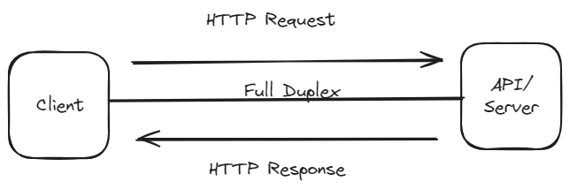

# Getting Started

For running the sample websocket project

## Step 1: Clone this repo

Open your terminal or command prompt, and typing this command `git clone https://github.com/bi-brilliant/xrun-websocket.git`

## Step 2: Move directory

And then typing this command `cd xrun-websocket`

## Step 3: Run the project

After that, you must install some dependencies first with command `npm install`, after installation finish you can run `npm start` and the nodejs will running on port 3005, after that you can open file **index.html as Client 1** and **index2.html as Client 2** for testing the websocket.

Just click the **Send** button and then view each log console on inspect element of your browser. You will see the realtime activity

# Sample simple flowchart

